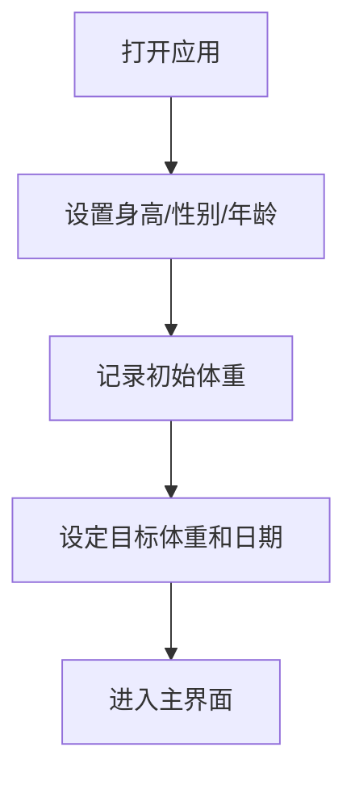
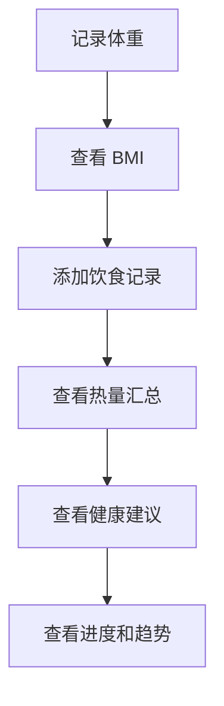

# FitTrack 个人健康管理应用 - 产品需求文档

## 1. 产品概述

FitTrack 是一款专注于个人健康管理的网页应用，帮助用户记录体重变化、追踪饮食热量、设定健康目标，并获得个性化的健康建议。应用采用明亮温暖的绿松石色系设计，白底卡片布局，营造清新健康的视觉体验。

### 目标用户
- 关注体重管理和身体健康的人群
- 希望科学追踪饮食热量的人群
- 需要设定和达成健康目标的个人

### 核心价值
- 简化日常健康数据记录
- 可视化展示体重趋势和进度
- 提供科学的热量计算和健康建议
- 数据本地存储，保护用户隐私

## 2. 功能模块

### 2.1 用户档案设置
首次使用时引导用户设置基本档案：
- 身高（cm）- 用于 BMI 计算
- 性别 - 用于基础代谢率计算
- 年龄 - 用于更精确的健康建议
- 当前体重（kg）- 初始记录

### 2.2 体重记录与 BMI 计算
**功能描述：**
- 快速记录每日体重数据
- 自动计算 BMI = 体重(kg) / 身高²(m²)
- 根据 BMI 值显示健康分类：
  - < 18.5：偏瘦
  - 18.5 - 23.9：正常
  - 24.0 - 27.9：超重
  - ≥ 28.0：肥胖
- 历史 BMI 数据查询

**交互设计：**
- 数字输入框配单位显示
- 一键记录今日体重
- BMI 以颜色标识的健康指示器展示

### 2.3 体重趋势图表
**功能描述：**
- 折线图展示体重历史变化
- 可切换时间范围：7天 / 30天 / 90天 / 全部
- 叠加目标体重参考线
- 显示体重变化趋势（上升/下降/稳定）

**技术实现：**
- 使用 Chart.js 渲染折线图
- 支持触摸滑动缩放
- 响应式图表尺寸

### 2.4 目标管理
**功能描述：**
- 设定目标体重
- 设定目标达成日期
- 显示当前进度：当前体重与目标体重的差距
- 根据近期体重趋势线性推算预估达标日期
- 目标达成庆祝动画

**计算逻辑：**
- 预估日期 = 目标日期 - (当前体重 - 目标体重) / 日均变化量
- 日均变化量基于最近 7 天体重数据计算

### 2.5 饮食记录
**功能描述：**
记录每日食物摄入：
- 食物名称
- 份量（克或份）
- 估算热量（kcal）
- 餐次分类：早餐 / 午餐 / 晚餐 / 加餐

**内置食物热量库（50+种常见食物）：**

| 类别 | 食物 | 热量 (kcal/100g) |
|------|------|------------------|
| 主食 | 白米饭 | 116 |
| 主食 | 全麦面包 | 247 |
| 主食 | 面条（煮） | 109 |
| 肉类 | 鸡胸肉 | 133 |
| 肉类 | 猪里脊 | 143 |
| 肉类 | 牛肉（瘦） | 106 |
| 鱼类 | 三文鱼 | 183 |
| 鱼类 | 鲈鱼 | 105 |
| 蛋类 | 鸡蛋 | 144 |
| 蛋类 | 蛋白 | 52 |
| 蔬菜 | 西兰花 | 34 |
| 蔬菜 | 胡萝卜 | 32 |
| 蔬菜 | 西红柿 | 18 |
| 蔬菜 | 黄瓜 | 15 |
| 蔬菜 | 菠菜 | 23 |
| 水果 | 苹果 | 52 |
| 水果 | 香蕉 | 89 |
| 水果 | 橙子 | 47 |
| 水果 | 葡萄 | 67 |
| 水果 | 西瓜 | 30 |
| 奶制品 | 牛奶 | 54 |
| 奶制品 | 酸奶 | 72 |
| 奶制品 | 奶酪 | 402 |
| 豆制品 | 豆腐 | 76 |
| 豆制品 | 黄豆 | 390 |
| 坚果 | 杏仁 | 579 |
| 坚果 | 花生 | 567 |
| 坚果 | 核桃 | 654 |
| 饮料 | 橙汁 | 45 |
| 饮料 | 可乐 | 42 |
| 零食 | 薯片 | 547 |
| 零食 | 饼干 | 435 |
| 零食 | 巧克力 | 546 |
| 中餐 | 包子（肉） | 227 |
| 中餐 | 饺子（蒸） | 218 |
| 中餐 | 炒饭 | 163 |
| 中餐 | 炒面 | 138 |
| 中餐 | 火锅 | 180 |
| 中餐 | 麻辣烫 | 120 |
| 中餐 | 炒青菜 | 45 |
| 中餐 | 红烧肉 | 478 |
| 中餐 | 宫保鸡丁 | 197 |
| 中餐 | 糖醋里脊 | 211 |
| 日料 | 寿司（6个） | 280 |
| 日料 | 拉面 | 436 |
| 日料 | 天妇罗 | 291 |
| 韩餐 | 拌饭 | 350 |
| 韩餐 | 烤肉（100g） | 250 |
| 韩餐 | 泡菜 | 14 |
| 西餐 | 汉堡 | 295 |
| 西餐 | 披萨（片） | 266 |
| 西餐 | 薯条（中） | 365 |

**每日汇总：**
- 按餐次分类显示
- 每日总热量计算
- 热量缺口 = (基础代谢 + 活动消耗) - 摄入热量

**基础代谢计算（ Mifflin-St Jeor 公式）：**
- 男：BMR = 10 × 体重(kg) + 6.25 × 身高(cm) - 5 × 年龄 + 5
- 女：BMR = 10 × 体重(kg) + 6.25 × 身高(cm) - 5 × 年龄 - 161
- 活动消耗：久坐 × 1.2 / 轻度活动 × 1.375 / 中度活动 × 1.55 / 重度活动 × 1.725

### 2.6 健康建议
基于用户数据生成个性化建议：
- **饮食建议**：根据 BMI 和目标调整饮食结构
- **运动建议**：根据体重和体能状态推荐运动强度
- **体重管理建议**：根据趋势提供具体的行动指南

**建议触发条件：**
- BMI 异常（偏瘦/超重/肥胖）
- 连续 7 天体重上升或下降
- 热量摄入持续超过/低于消耗
- 目标进度落后

### 2.7 数据管理
**数据备份：**
- 一键导出所有数据为 JSON 文件
- 支持选择备份日期范围

**数据恢复：**
- 导入 JSON 文件恢复数据
- 数据校验和冲突处理提示

## 3. 核心流程

### 3.1 首次使用流程


### 3.2 每日记录流程


## 4. 用户界面设计

### 4.1 设计风格
**配色方案：**
- 主色：绿松石色 #40E0D0
- 辅助色：深绿松石 #20B2AA
- 强调色：珊瑚橙 #FF6B6B
- 背景色：纯白 #FFFFFF
- 卡片背景：淡灰白 #F8FFFE
- 文字主色：深灰 #2D3748
- 文字次色：灰色 #718096

**按钮样式：**
- 圆角按钮（border-radius: 12px）
- 渐变背景
- 悬停阴影效果

**字体：**
- 标题：思源黑体 / Noto Sans SC Bold
- 正文：思源黑体 / Noto Sans SC Regular
- 数字：DIN Alternate / Roboto Mono

**布局：**
- 顶部导航栏
- 卡片式内容区
- 底部快捷操作栏

**图标风格：**
- 使用 Lucide Icons
- 线性图标风格
- 统一 stroke-width

### 4.2 页面结构

| 页面 | 模块 | 描述 |
|------|------|------|
| 首页 | 今日概览卡片 | 体重、BMI、热量缺口一目了然 |
| 首页 | 快捷操作按钮 | 记录体重、添加饮食 |
| 首页 | 体重趋势图 | 7天/30天/90天/全部切换 |
| 目标页 | 目标设置卡片 | 目标体重、日期、进度环 |
| 目标页 | 预估达标日期 | 线性推算显示 |
| 饮食页 | 餐次标签 | 早餐/午餐/晚餐/加餐 |
| 饮食页 | 食物列表 | 可增删改 |
| 饮食页 | 热量汇总 | 今日总热量、缺口 |
| 建议页 | 健康卡片 | 饮食/运动/管理建议 |
| 设置页 | 用户档案 | 身高/性别/年龄/活动强度 |
| 设置页 | 数据管理 | 备份/恢复/清除 |

### 4.3 响应式设计
- **桌面端（> 1024px）**：双栏布局，侧边导航
- **平板端（768px - 1024px）**：单栏布局，顶部导航
- **移动端（< 768px）**：底部导航卡片，全宽图表

### 4.4 动画效果
- 页面切换：淡入淡出（300ms ease）
- 卡片出现：向上滑入 + 淡入（staggered 100ms）
- 数据更新：数字滚动动画
- 目标达成：庆祝粒子动画
- 按钮交互：缩放 + 阴影变化
- 图表加载：数据点逐个绘制

## 5. 数据存储

### 5.1 本地存储结构
使用 localStorage 存储所有数据：
- `fittrack_profile`：用户档案
- `fittrack_weights`：体重记录列表
- `fittrack_meals`：饮食记录列表
- `fittrack_goals`：目标设置
- `fittrack_settings`：应用设置

### 5.2 数据格式
```typescript
interface Profile {
  height: number;      // cm
  gender: 'male' | 'female';
  age: number;
  activityLevel: 'sedentary' | 'light' | 'moderate' | 'active';
}

interface WeightRecord {
  date: string;        // YYYY-MM-DD
  weight: number;      // kg
  bmi?: number;
}

interface MealRecord {
  id: string;
  date: string;        // YYYY-MM-DD
  mealType: 'breakfast' | 'lunch' | 'dinner' | 'snack';
  food: string;
  amount: number;      // g
  calories: number;    // kcal
}

interface Goal {
  targetWeight: number;
  targetDate: string;  // YYYY-MM-DD
  createdAt: string;
}
```
