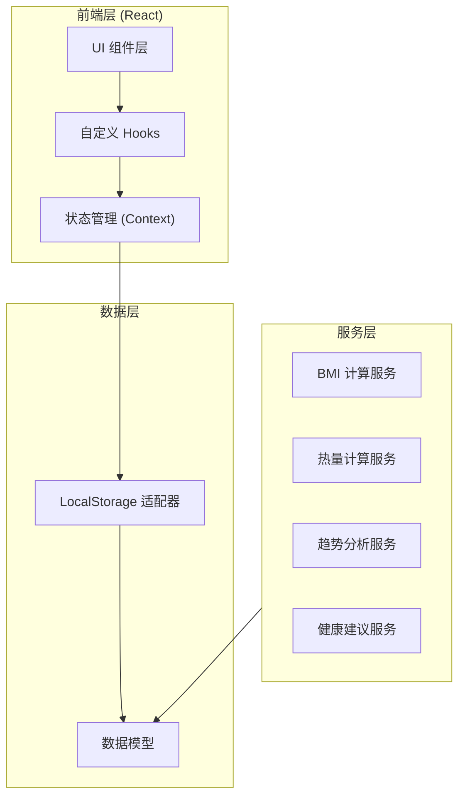
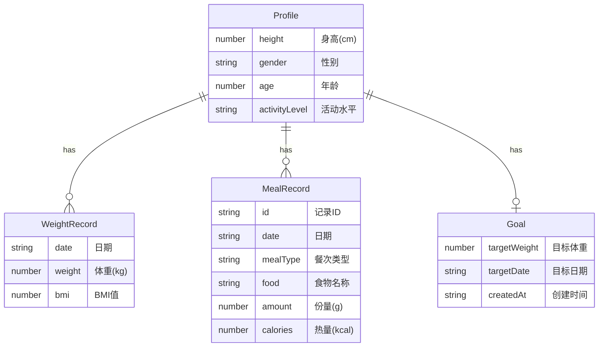

# FitTrack 个人健康管理应用 - 技术架构文档

## 1. 架构设计



## 2. 技术选型

### 2.1 核心技术栈
- **前端框架**：React 18 + TypeScript
- **构建工具**：Vite
- **样式方案**：Tailwind CSS + 自定义 CSS 变量
- **图表库**：Chart.js + react-chartjs-2
- **图标库**：Lucide React
- **日期处理**：Day.js
- **数据存储**：LocalStorage
- **状态管理**：React Context + useReducer

### 2.2 项目初始化
```bash
npm create vite@latest fittrack -- --template react-ts
cd fittrack
npm install
npm install chart.js react-chartjs-2 lucide-react dayjs
npm install -D tailwindcss postcss autoprefixer
npx tailwindcss init -p
```

## 3. 路由定义

| 路由 | 页面 | 功能描述 |
|------|------|----------|
| `/` | 首页 Dashboard | 今日概览、体重记录、快捷操作 |
| `/goals` | 目标页面 | 目标设置、进度追踪、预估日期 |
| `/meals` | 饮食页面 | 饮食记录、热量追踪、食物库 |
| `/advice` | 建议页面 | 健康建议展示 |
| `/settings` | 设置页面 | 用户档案、数据管理 |

## 4. 组件结构

```
src/
├── components/
│   ├── layout/
│   │   ├── Navbar.tsx          # 顶部导航栏
│   │   ├── BottomNav.tsx      # 底部导航（移动端）
│   │   ├── Sidebar.tsx        # 侧边导航（桌面端）
│   │   └── PageContainer.tsx  # 页面容器
│   ├── dashboard/
│   │   ├── TodayOverview.tsx  # 今日概览卡片
│   │   ├── QuickActions.tsx   # 快捷操作按钮
│   │   └── WeightTrend.tsx    # 体重趋势图
│   ├── weight/
│   │   ├── WeightInput.tsx    # 体重输入组件
│   │   ├── BMICard.tsx       # BMI 展示卡片
│   │   └── WeightList.tsx    # 历史体重列表
│   ├── goal/
│   │   ├── GoalSetting.tsx   # 目标设置表单
│   │   ├── ProgressRing.tsx  # 进度环组件
│   │   └── EstimatedDate.tsx # 预估日期显示
│   ├── meals/
│   │   ├── MealTypeTabs.tsx  # 餐次标签切换
│   │   ├── MealList.tsx       # 饮食记录列表
│   │   ├── AddMealForm.tsx   # 添加饮食表单
│   │   ├── FoodPicker.tsx    # 食物选择器
│   │   └── CalorieSummary.tsx # 热量汇总
│   ├── advice/
│   │   ├── AdviceCard.tsx    # 建议卡片
│   │   └── AdviceList.tsx    # 建议列表
│   └── settings/
│       ├── ProfileForm.tsx   # 档案表单
│       └── DataManagement.tsx # 数据管理
├── hooks/
│   ├── useProfile.ts         # 用户档案 Hook
│   ├── useWeights.ts          # 体重记录 Hook
│   ├── useMeals.ts            # 饮食记录 Hook
│   ├── useGoals.ts            # 目标管理 Hook
│   └── useLocalStorage.ts     # LocalStorage Hook
├── context/
│   ├── AppContext.tsx         # 全局应用上下文
│   └── types.ts              # Context 类型定义
├── services/
│   ├── bmiService.ts          # BMI 计算服务
│   ├── calorieService.ts      # 热量计算服务
│   ├── trendService.ts        # 趋势分析服务
│   └── adviceService.ts       # 健康建议服务
├── data/
│   └── foodDatabase.ts        # 内置食物热量库
├── utils/
│   ├── dateUtils.ts          # 日期工具函数
│   ├── storageUtils.ts       # 存储工具函数
│   └── formatters.ts         # 格式化工具
├── types/
│   └── index.ts              # 全局类型定义
├── App.tsx                   # 应用入口
├── main.tsx                 # React 入口
└── index.css                # 全局样式
```

## 5. 数据模型

### 5.1 数据模型定义



### 5.2 TypeScript 类型定义

```typescript
// 用户档案
interface Profile {
  height: number;           // cm
  gender: 'male' | 'female';
  age: number;
  activityLevel: 'sedentary' | 'light' | 'moderate' | 'active';
}

// 体重记录
interface WeightRecord {
  date: string;             // YYYY-MM-DD
  weight: number;          // kg
  bmi?: number;
}

// 饮食记录
interface MealRecord {
  id: string;              // UUID
  date: string;           // YYYY-MM-DD
  mealType: 'breakfast' | 'lunch' | 'dinner' | 'snack';
  food: string;
  amount: number;         // g
  calories: number;       // kcal
}

// 目标
interface Goal {
  targetWeight: number;    // kg
  targetDate: string;     // YYYY-MM-DD
  createdAt: string;      // ISO timestamp
}

// 健康建议
interface HealthAdvice {
  id: string;
  type: 'diet' | 'exercise' | 'management';
  title: string;
  content: string;
  priority: number;       // 1-3, 1为最高优先级
}

// 食物数据库项
interface FoodItem {
  name: string;
  caloriesPer100g: number;
  category: string;
}
```

## 6. 核心服务算法

### 6.1 BMI 计算
```typescript
function calculateBMI(weight: number, height: number): number {
  const heightInMeters = height / 100;
  return weight / (heightInMeters * heightInMeters);
}

function getBMICategory(bmi: number): string {
  if (bmi < 18.5) return '偏瘦';
  if (bmi < 24) return '正常';
  if (bmi < 28) return '超重';
  return '肥胖';
}
```

### 6.2 基础代谢率 (BMR)
```typescript
function calculateBMR(weight: number, height: number, age: number, gender: string): number {
  if (gender === 'male') {
    return 10 * weight + 6.25 * height - 5 * age + 5;
  } else {
    return 10 * weight + 6.25 * height - 5 * age - 161;
  }
}

const activityMultipliers = {
  sedentary: 1.2,
  light: 1.375,
  moderate: 1.55,
  active: 1.725
};

function calculateTDEE(bmr: number, activityLevel: string): number {
  return bmr * activityMultipliers[activityLevel];
}
```

### 6.3 趋势预估
```typescript
function estimateCompletionDate(
  currentWeight: number,
  targetWeight: number,
  recentWeights: WeightRecord[]
): string | null {
  if (recentWeights.length < 7) return null;
  
  const recent = recentWeights.slice(-7);
  const dailyChange = (recent[6].weight - recent[0].weight) / 6;
  
  if (Math.abs(dailyChange) < 0.01) return null;
  
  const weightDiff = currentWeight - targetWeight;
  const daysNeeded = Math.ceil(weightDiff / dailyChange);
  
  const targetDate = new Date();
  targetDate.setDate(targetDate.getDate() + daysNeeded);
  
  return targetDate.toISOString().split('T')[0];
}
```

## 7. 样式设计系统

### 7.1 CSS 变量定义
```css
:root {
  --color-primary: #40E0D0;
  --color-primary-dark: #20B2AA;
  --color-accent: #FF6B6B;
  --color-success: #48BB78;
  --color-warning: #ECC94B;
  --color-error: #F56565;
  
  --bg-primary: #FFFFFF;
  --bg-secondary: #F8FFFE;
  --bg-card: #FFFFFF;
  
  --text-primary: #2D3748;
  --text-secondary: #718096;
  --text-muted: #A0AEC0;
  
  --radius-sm: 8px;
  --radius-md: 12px;
  --radius-lg: 16px;
  --radius-full: 9999px;
  
  --shadow-sm: 0 1px 2px rgba(0, 0, 0, 0.05);
  --shadow-md: 0 4px 6px rgba(0, 0, 0, 0.07);
  --shadow-lg: 0 10px 15px rgba(0, 0, 0, 0.1);
  
  --transition-fast: 150ms ease;
  --transition-normal: 300ms ease;
  --transition-slow: 500ms ease;
}
```

### 7.2 响应式断点
```css
/* 移动端优先 */
/* 小型设备 */
@media (min-width: 640px) { }

/* 中型设备（平板）*/
@media (min-width: 768px) { }

/* 大型设备（桌面）*/
@media (min-width: 1024px) { }

/* 超大型设备 */
@media (min-width: 1280px) { }
```

## 8. 性能优化

### 8.1 代码分割
- 使用 React.lazy 进行路由级代码分割
- 图表组件懒加载

### 8.2 数据缓存策略
- LocalStorage 读取结果缓存到 Context
- 仅在数据变更时更新存储

### 8.3 动画优化
- 使用 CSS transform 替代 top/left 定位
- 启用 GPU 加速 (will-change: transform)
- 使用 requestAnimationFrame 处理复杂动画
